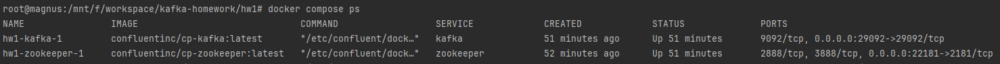
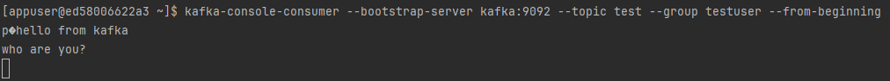

# Развертывание инфраструктуры kafka при помощи docker compose

## 1. Описание необходимых контейнеров для работы kafka

Для работы брокера сообщений Kafka необходимо объявить два контейнера для kafka и zookeeper:

```
  zookeeper:
    image: confluentinc/cp-zookeeper:latest
    environment:
      ZOOKEEPER_CLIENT_PORT: 2181
      ZOOKEEPER_TICK_TIME: 2000
    ports:
      - 22181:2181
    networks:
      - kafka_net

  kafka:
    image: confluentinc/cp-kafka:latest
    depends_on:
      - zookeeper
    ports:
      - 29092:29092
    environment:
      KAFKA_BROKER_ID: 1
      KAFKA_ZOOKEEPER_CONNECT: zookeeper:2181
      KAFKA_ADVERTISED_LISTENERS: PLAINTEXT://kafka:9092,PLAINTEXT_HOST://localhost:29092
      KAFKA_LISTENER_SECURITY_PROTOCOL_MAP: PLAINTEXT:PLAINTEXT,PLAINTEXT_HOST:PLAINTEXT
      KAFKA_INTER_BROKER_LISTENER_NAME: PLAINTEXT
      KAFKA_OFFSETS_TOPIC_REPLICATION_FACTOR: 1
    networks:
      - kafka_net
```

После описания данных контейнеров можно сразу их и запустить при помощи следующей консольной команды:

```docker compose up -d --build```

При помощи команды `docker compose ps` можно вывести состояние запущенных контейнеров:


## 2. Описание контейнера для взаимодействия с kafka через ui (Опционально)

Для более удобного взаимодействия с брокером kafka можно воспользоваться приложением kafka-ui из докер образа `provectuslabs/kafka-ui:latest`

Описание в docker-compose.yml:
```
  kafka-ui:
    container_name: kafka-ui
    image: provectuslabs/kafka-ui:latest
    restart: unless-stopped
    ports:
      - 8099:8080
    environment:
      DYNAMIC_CONFIG_ENABLED: 'true'
    volumes:
      - ../kui/config.yml:/etc/kafkaui/dynamic_config.yaml
    networks:
      - kafka_net
```
Первоначальная конфигурация подключения к кластеру кафка была вынесена в отдельный файл [config.yml](..%2Fkui%2Fconfig.yml), подключаемый в качестве раздела к контейнеру.

Пример описания базовой конфигурации:
```
auth:
  type: DISABLED
kafka:
  clusters:
  - bootstrapServers: kafka:9092
    name: localhost
    properties: {}
    readOnly: false
rbac:
  roles: []
webclient: {}
```
При настройке кластера через ui, данный файл будет обновлен. По умолчанию к ui можно обратиться по адресу http://localhost:8099/


## 3. Создание первого топика

Для создания топика в kafka достаточно выполнить следующую команду в терминале контейнера или же с любого другого удаленного хоста:

```kafka-topics --bootstrap-server kafka:9092 --create --topic test --replication-factor 1 --partitions 3```

Аргументы:

- --bootstrap-server - адрес кластера kafka
- --topic - наименование создаваемого топика
- --replication-factor - количество допустимых реплик для каждой из партиций создаваемого топика
- --partitions - количество партиций создаваемого топика

Результат создания соответствующего топика:


Так же данный топик будет отображен в kafka-ui в соответствующем разделе топиков:


## 4. Отправка и чтение сообщений из топика Kafka

Для отправки сообщений в топик kafka можно воспользоваться утилитой `kafka-console-producer`:

```kafka-console-producer --bootstrap-server kafka:9092 --topic test```

Аргументы:

- --bootstrap-server - адрес кластера kafka
- --topic - наименование создаваемого топика


Сообщения в kafka-ui:


Для чтения сообщений из топика kafka можно воспользоваться утилитой `kafka-console-consumer`:

```kafka-console-consumer --bootstrap-server kafka:9092 --topic test --group testuser --from-beginning```

Аргументы:

- --bootstrap-server - адрес кластера kafka
- --topic - наименование создаваемого топика
- --group - идентификатор группы в рамках которой происходит чтение сообщений
- --from-beginning - режим чтения сообщений из топика в случае. Если для текущей группы отсутствует смещение в данном топике, то чтение сообщений начнется с самого начала.


